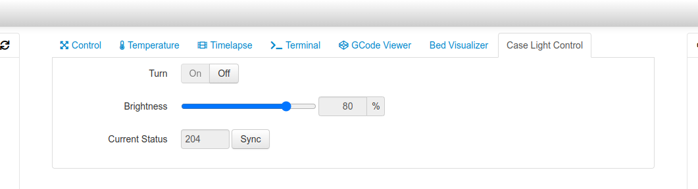

# OctoPrint-CaseLightControl

This plugin controls the brightness of the case light via `M355` G-code command.

## Setup

Install via the bundled [Plugin Manager](https://docs.octoprint.org/en/master/bundledplugins/pluginmanager.html)
or manually using this URL:

    https://github.com/bgpat/OctoPrint-CaseLightControl/archive/master.zip

## Supported Firmware

- [x] [Marlin](https://marlinfw.org/)
